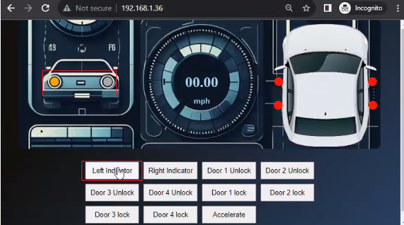
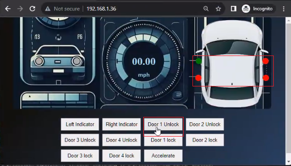
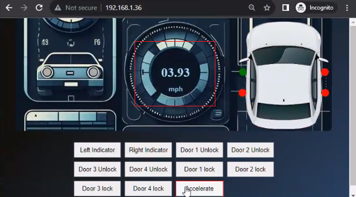

# GearGoat : A Car Vulnerabilities Simulator


A python implementation inspired from [ICSim](https://github.com/zombieCraig/ICSim). Currently supports running on a single interface "vcan0" and fixed arbitration IDs for the actions including, turn indicators, door lock unlock indicators and speedometer.

The simulator runs in browser with control buttons for the user to interact.

### Developed with :heart: by [INE](https://ine.com/) 


## Built With

* Python 3
* Docker 

# Getting Started

### Prerequisites
* Linux machine
* Docker 
(for installing docker on linux)  
```
curl -fsSL https://get.docker.com -o get-docker.sh
sudo sh get-docker.sh
```
Further instructions [here](https://docs.docker.com/engine/install/) 

### Installation

**Step 1.** Clone the repo and navigate into the directory

```sh
git clone https://github.com/ine-labs/GearGoat.git
cd GearGoat
```

**Step 2.** Inside the repository directory, run the following to install required utilities and build the docker container. 

```sh
sudo chmod +x initial_setup.sh
sudo ./initial_setup.sh
```

**Step 3.** Setup the vcan0 interface
```sh
sudo chmod +x vcan_setup.sh
sudo ./vcan_setup.sh
```

If you face any trouble with the above script related to setting up "vcan0" interface, try running this command:

```sh
sudo apt-get install -y linux-modules-extra-$(uname -r)
```

**Step 4.** Run the docker container

```sh
sudo docker run --network="host" --privileged geargoat
```

**Step 5.** The web UI can be accessed at port 80 of the machine in which the container is running.
```
http://localhost or http://<the_machine_ip>
```

## Usage
There are mainly three car actions that can be performed with this web UI, which includes:
1. Toggling turn signals
2. Locking/Unlocking Doors
3. Updating the speedometer.


Try out each buttons and observe the actions in the UI.

Clicking on indicator buttons switches the state for a fraction of second. The color changes to "orange". **Click for a slightly longer duration to register the signal change**.



The door is initially locked indicated by "red". It can be unlocked by clicking the corresponding door unlock button which turns the indicator to "green". Clicking the corresponding door lock button again will revert it back to "red".




Finally the accelerate button, which will respond towards mouse clicks. Clicking and holding the button (mousedown) will result in speed increase and releasing the button(mouseup) results in speed falling down.




**All these actions generate corresponding CAN packets.**

After usage, you can turn off the simulator by killing the docker container.
```sh
CONTAINER_ID=$(docker ps -qf "ancestor=geargoat")
docker kill $CONTAINER_ID
```

## Contributors
Nishant Sharma, Director, Lab Platform, INE <nsharma@ine.com>

Pranjal Soni, Software Engineer (Cloud), INE <psoni@ine.com>


## Contribution Guidelines

* Contributions in the form of code improvements, feature additions, and any general suggestions are welcome. 
* The source code can be found inside ``container\``


# Sister Projects
- [AWSGoat](https://github.com/ine-labs/AWSGoat)
- [AzureGoat](https://github.com/ine-labs/AzureGoat)
- [GCPGoat](https://github.com/ine-labs/GCPGoat)
- [PA Toolkit (Pentester Academy Wireshark Toolkit)](https://github.com/pentesteracademy/patoolkit)
- [ReconPal: Leveraging NLP for Infosec](https://github.com/pentesteracademy/reconpal) 
- [VoIPShark: Open Source VoIP Analysis Platform](https://github.com/pentesteracademy/voipshark)
- [BLEMystique](https://github.com/pentesteracademy/blemystique)
