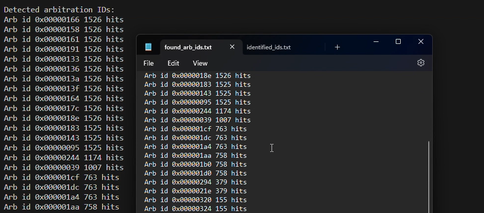

# Objectives
To find out the arbitration IDs and the corresponding message data and positional bytes for all the actions in GearGoat using CaringCaribou.

# Solution

**Step 0:** To install Caring Caribou:
1. Clone the repository and run the installation file:
```
git clone https://github.com/CaringCaribou/caringcaribou.git
cd caringcaribou/
sudo python3 setup.py install
```
2. Return back to the previous location and run the following:
```
cd ..
printf "[default]\ninterface = socketcan\nchannel = vcan0" > $HOME/.canrc

```
More info here:- [CaringCaribou](https://github.com/CaringCaribou/caringcaribou)

**Step 1:** The GearGoat setup will look something like this with terminal in background and the GearGoat window marked on top.


**Step 2:** We will explore the reverse engineering capabilities of "CaringCaribou" using "GearGoat". We will try to figure out the Arbitration IDs of the actions we performed in the simulator.

First we will scan for unique Arbitration IDs in the network using the "listener" module.

**Command:**

```
cc.py listener -h
```

**Command:**

```
cc.py listener -r
```
Now perform all the actions in the simulator. This will ensure that all the unique Arbitration IDs are captured.


Once you press "Ctrl+C" to stop the listener, you will get a list of all the Arbitration IDs captured in the terminal


Copy these unique ids in any text file editor.



**Step 3:** Now we will try to find out the Arbitration IDs responsible for the actions we performed in the simulator. We will use the "fuzzer" module for this.

**Command:**

```
cc.py fuzzer -h
```


 With fuzzer module we can send random data in the network with a specific Arbitration ID. Some of the packets sent via fuzzer module will trigger the actions in the simulator. We will use this information to find out the Arbitration IDs responsible for the actions.


```
cc.py fuzzer random -h
```


Our approach will be to try out each of the unique ids found one by one and see if any of them triggers the action in the simulator.

**Command:**
```
cc.py fuzzer random -id 0x19b
```


If the ID is correct, you will see the corresponding action being triggered in the simulator, with all the randomized data. In this case the doors are randomly locking and unlocking in the simulator indicating the ID is meant for the door indicator.


**Once checked you can stop the fuzzing by pressing "Ctrl+C" and try out the next ID from the list until IDs for all the actions are found.**

The ids will come down to this
```
0x19b - Door Indicator
0x188 - Turn Signal Indicator
0x244 - Speedometer
```

**Step 4:** Now we will try to find out the **positional bytes and data** responsible for the actions. 

**In a message packet finding the exact data byte position and value responsible for the action, is crucial since some other data can be present for an ID at other positions, and we want to identify the ID, data combination resulting in our desired action.**

**Command:**

```
cc.py fuzzer brute -h
```


**Command:**

```
cc.py fuzzer brute 0x19b ..
```


It tries out all the possible combinations of data bytes for the given Arbitration ID at the **first positional byte**. The ".." indicates the changing values.


We will now try out all the positional bytes until we find the one responsible for the action.

**Command:**

```
cc.py fuzzer brute 0x19b 00..
```
For trying the second byte we fixed our first byte by keeping it "00" and making the second byte ".."


lets try out the third byte

**Command:**

```
cc.py fuzzer brute 0x19b 0000..
```


You will notice the door indicators updating as all the data is being tried out.

**This means that the 3rd byte is responsible for the door state.**

We can store the brute forced packets in a txt file for later use.

**Command:**

```
cc.py fuzzer brute 0x19b 0000.. -f door_indicator.txt
```


**Step 5:** Now we will try to find out the **data** responsible for generating the exact door state by watching the brute forced packets replayed one by one and correlating with the UI. The 2 second delay will allow us to observe the changes in the UI.

**Command:**

```
cc.py fuzzer identify -d 2 door_indicator.txt
```


You will notice the door indicators updating as all the data is being tried out. After 16th data packet states are being repeated, indicating there are 16 possible states for the doors.
For 4 doors there are 2 * 2 * 2 * 2 = 16 possible door states, where from the 4 doors the state can either be LOCKED or UNLOCKED.

| 8 | 4 | 2 | 1 | Message Data (Hexadecimal) |
|---|---|---|---|-----------------------------|
| 0 | 0 | 0 | 0 | 00000 |
| 0 | 0 | 0 | 1 | 00001 |
| 0 | 0 | 1 | 0 | 00002 |
| 0 | 0 | 1 | 1 | 00003 |
| 0 | 1 | 0 | 0 | 00004 |
| 0 | 1 | 0 | 1 | 00005 |
| 0 | 1 | 1 | 0 | 00006 |
| 0 | 1 | 1 | 1 | 00007 |
| 1 | 0 | 0 | 0 | 00008 |
| 1 | 0 | 0 | 1 | 00009 |
| 1 | 0 | 1 | 0 | 0000A |
| 1 | 0 | 1 | 1 | 0000B |
| 1 | 1 | 0 | 0 | 0000C |
| 1 | 1 | 0 | 1 | 0000D |
| 1 | 1 | 1 | 0 | 0000E |
| 1 | 1 | 1 | 1 | 0000F |


These 16 states are being covered by the 3rd byte. Changing the bits in binary and getting the hexadecimal value we can generate all the 16 states. 


With this info now we can try out sending a specific data packet to trigger the exact door state.

**Command:**

```
cc.py send message 0x19b#00.00.01
```


The door 1 was locked while the other doors unlocked. Correlating the hexadecimal message data with its binary equivalent we can observe that "1" is being used as a LOCK bit and "0" as an UNLOCK bit in binary. The combination of these bits are being used to generate all the 16 states.

