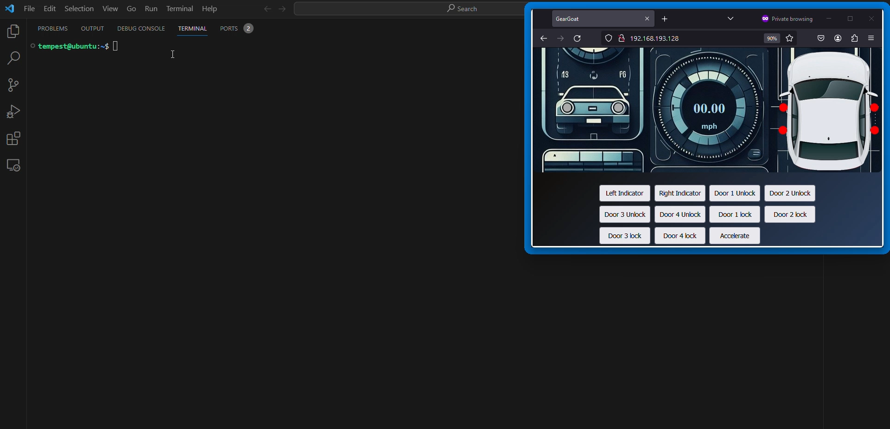
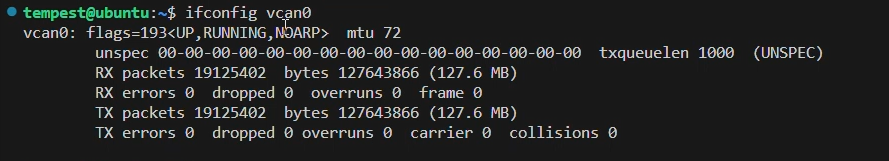
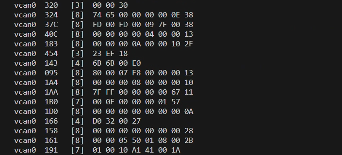
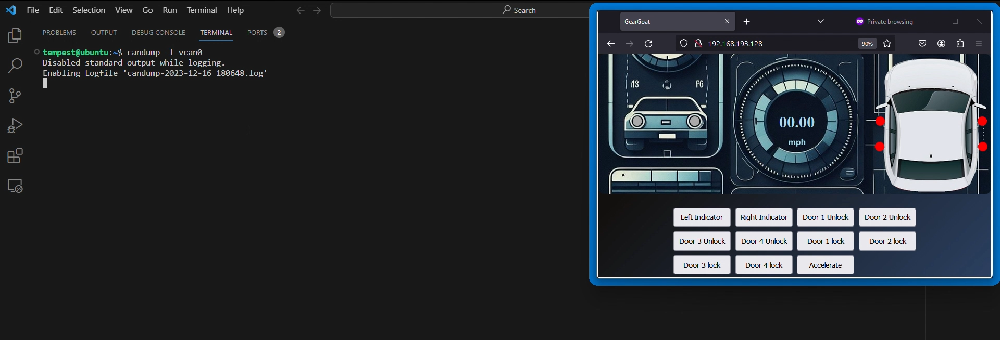
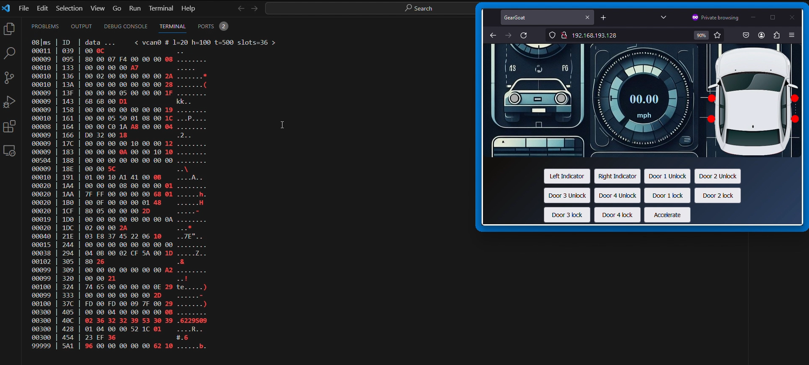
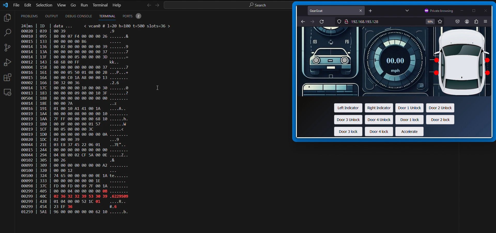
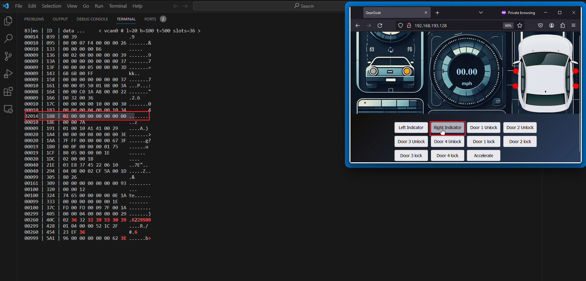
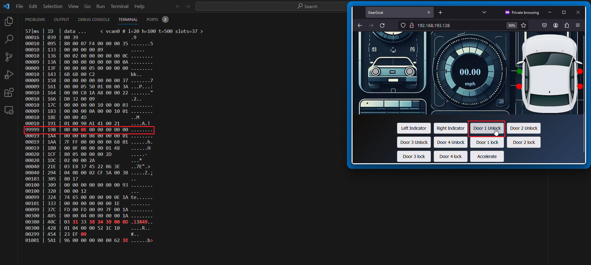
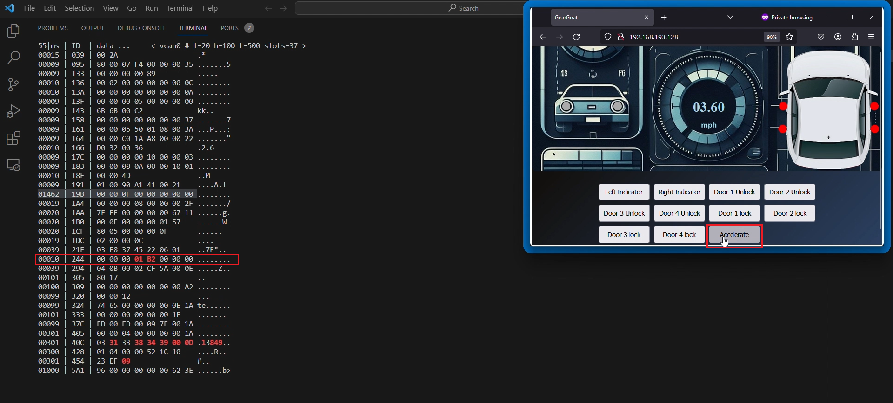

# Objectives
Perform a basic replay attack using can-utils and find out the arbitration IDs for all the actions in GearGoat.

# Solution

**Step 0:** Ensure that the GearGoat browser window is marked "always on top". (In Windows a window can be marked always on top with shortcut "Win"+"Ctrl"+"t" from powertools which will result in a blue boundary).

**Step 1:** The GearGoat setup will look something like this with terminal in background and the GearGoat window marked on top.



**Step 2:** Once you get a hang of simulator controls, run the command in the terminal.

**Command:**

```bash
ifconfig vcan0 
```



The command confirms us the virtual CAN interface **vcan0** running in the background.

Next fire the command from "can-utils",

**Command:**

```bash
candump vcan0 
```
The command shows us the packets currently flowing in the network. A random can noise file plays in the background when the container initially launches.




**Step 3:** Once you have observed the network data, We will now try to log our actions using these data packets. Fire the command in the terminal.
**Command:**

```bash
candump -l vcan0 
```



This will start to record and log data packets from this point of time until its stopped.

**Step 4:** Click on the Simulator window to bring it in focus. Now we will perform some random actions and stop the logger to store the corresponding data packets of our actions.

**Note: Once Unlocked, Lock the same door to be able to see the UNLOCK, LOCK sequence again while replaying.**   

Click back on the terminal window and press "Ctrl+C" to stop logging the data. The file has been stored in the directory with this format
```
<name of log file>.log
```
The content of the lab file can be viewed by 

```
cat <name of log file>.log
```
**Step 5:** Using the packets now we will perform a basic replay attack with the following command, Keep a close eye on the simulator UI.

**Command:**
```
canplayer -I <name of log file>.log
```
You will observe the same set of actions being repeated on the UI as performed by you. You can go around trying with different set of actions and replaying them. The data packets are sent in the network and corresponding actions are replayed.

**Step 6:** Next we will try to figure the arbitration IDs of the actions in the simulator using *cansniffer* by observing the changes in data bytes. This method can be used for quick identification.
**Command:**

```bash
cansniffer -c vcan0
```
We can now see the traffic in the network. **Make sure the data packets are only changing in place and the terminal is not scrolling. If it does scrolls, press "Ctrl+C" to stop sniffing, reduce the font size and fire the command again.**

The terminal window will look something like this, the data bytes will be only changing in place. The data packets are now grouped by the arbitration IDs.



The red color shows the changing data bytes.

With terminal in focus, press on keyboard "SHIFT+3+ENTER" (3 key presses). This will turn off the highlighting. Keep repeating until most data color isn't changing. It will now look like this.



**Step 7:** We can now find the data packet by observing the message data color change. In the web UI click on Left and Right Indicator Buttons, you will find a data frame changing



The arbitration ID for the turn indicator turns out to be:
```
0x188
```

Notice the first byte of the message data when "right indicator" is clicked.  It changes as the indicator button is clicked. In binary, this value is equal to "10".

With turn signal indicators we can have 4 possible states as:
```
LEFT: OFF
RIGHT: OFF

LEFT: ON
RIGHT: OFF

LEFT: OFF
RIGHT: ON

LEFT: ON
RIGHT: ON
```
These states in binary with their corresponding hexadecimal value can be represented as:
| 2 | 1 | hexadecimal |
| - | - | ----------- |
| 0 | 0 | 00 |
| 0 | 1 | 01 |
| 1 | 0 | 02 |
| 1 | 1 | 03 |

These values can be observed in the terminal as you click on both the turn indicators.
| LEFT | RIGHT | MESSAGE DATA |
| - | - | ----------- |
| OFF | OFF | 00 |
| ON | OFF | 01 |
| OFF| ON | 02 |
| ON | ON | 03 |

You can also try out in a different terminal window this message data using cansend and observe the simulator window.
**Command:**
```
cansend vcan0 188#0100000000000000
cansend vcan0 188#0200000000000000
cansend vcan0 188#0300000000000000
```

**Step 8:** We can now find out other arbitration IDs too, click on "Door Unlock" and "Door Lock" button for each 4 doors and observe the terminal output,



The arbitration IDs for the doors turn out to be:

```
0x19b
```
You can observe the message data in the terminal window by clicking the unlock buttons for all the doors while ensuring the other doors remain locked to figure out message data to unlock that specific door.

| 8 | 4 | 2 | 1 |Message Data(Hexadecimal) |Door Status |
|-|-|-|-|-|-|
| 1 | 1 | 1 | 0 | 00000E | Door 1 Unlocked, Rest all locked
| 1 | 1 | 0 | 1 | 00000D | Door 2 Unlocked, Rest all locked
| 1 | 0 | 1 | 1 | 00000B | Door 3 Unlocked, Rest all locked
| 0 | 1 | 1 | 1 | 000007 | Door 4 Unlocked, Rest all locked

The changing bits can be observed in the terminal.

**Step 9:** Now lets find out the arbitration ID for speedometer. Click and hold the "Accelerate"  Button in the UI, you will find a data frame changing. This time data will be continuously increasing indicating the increase in speed.




The arbitration ID for the speedometer is:
```
0x244
```
The 4th and 5th bytes are being used to change the speed on the meter. The values increase generating a corresponding change on the UI.

In case of speed multiple data packets are continuously being sent in the CAN Bus for each speed value.